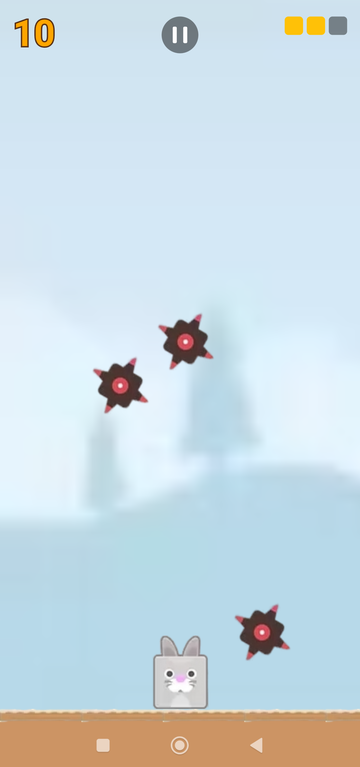
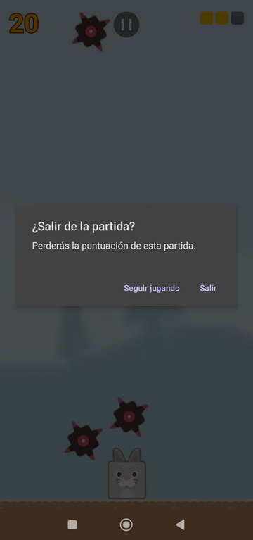
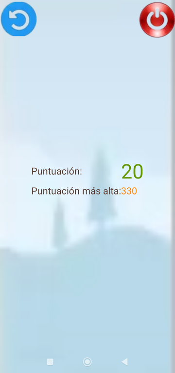

# 🐰 Conejo Jorge — Juego Móvil Android


[](https://github.com/Jocude/ConejoMobileApp/actions/workflows/ci.yml)

**Conejo Jorge** es un videojuego de acción para Android en el que controlas a un conejo que debe esquivar picos que caen desde arriba. ¡Sobrevive el mayor tiempo posible, acumula puntos y supera tu récord!

---

## 📥 Descarga

Descarga el APK desde la sección [**Releases**](https://github.com/Jocude/ConejoMobileApp/releases) e instálalo en tu móvil (Android 10 o superior).

---

## 📱 Capturas de pantalla

| Inicio | Partida | Salir de la partida | Game Over |
|:---:|:---:|:---:|:---:|
|  |  |  |  |

---

## 🎮 Mecánicas de juego

| Mecánica | Descripción |
|---|---|
| **Control del conejo** | Desliza el dedo en la mitad inferior de la pantalla para mover al conejo horizontalmente |
| **Picos** | Caen desde la parte superior en posiciones y velocidades aleatorias (cada uno tarda entre 1,5 y 3 s en cruzar la pantalla, igual en cualquier móvil). Solo golpea su cuerpo redondo: las puntas no cuentan |
| **Dificultad** | Empiezan 3 picos; cada 300 puntos cae uno más (hasta 6) y la velocidad sube poco a poco hasta el doble a los 1500 puntos |
| **Puntuación** | Cada pico que toca el suelo sin golpear al conejo suma **+10 puntos** |
| **Vidas** | El jugador empieza con **3 vidas** (casillas verde → amarilla → roja) |
| **Sonido y vibración** | Golpe con vibración, sonido suave al caer cada pico y melodía de Game Over |
| **Explosiones** | Cada vez que un pico llega al suelo se reproduce una animación de explosión |
| **Game Over** | Al perder las 3 vidas se muestra la puntuación; «Jugar otra vez» empieza una partida nueva directamente |
| **Récord** | La puntuación más alta se guarda localmente con `SharedPreferences` |
| **Pausa** | Botón arriba en el centro; también al salir de la app o bajar las notificaciones. El botón atrás pregunta antes de abandonar la partida |
| **Idiomas** | Español e inglés, según el idioma del móvil |

---

## 🏗️ Arquitectura del proyecto

```
ConejoMobileApp/
├── ConejoJorge/                          # Proyecto Android (Gradle)
│   ├── app/src/
│   │   ├── main/
│   │   │   ├── java/com/example/conejojorge/
│   │   │   │   ├── MainActivity.kt       # Pantalla de inicio; aloja la partida y la pausa/reanuda
│   │   │   │   ├── GameView.kt           # Motor del juego (bucle, lógica, dibujo y control táctil)
│   │   │   │   ├── GameSprites.kt        # Imágenes del juego, cargadas una sola vez
│   │   │   │   ├── GameAudio.kt          # Efectos de sonido y vibración
│   │   │   │   ├── Difficulty.kt         # Dificultad progresiva según los puntos
│   │   │   │   ├── Spike.kt              # Pico: posición, velocidad, animación y colisión
│   │   │   │   ├── Explosion.kt          # Animación de explosión
│   │   │   │   └── GameOver.kt           # Pantalla de resultados y récord
│   │   │   ├── res/
│   │   │   │   ├── layout/               # activity_main.xml, game_over.xml
│   │   │   │   ├── drawable/             # Sprites: conejo, picos, explosiones, fondo, suelo…
│   │   │   │   ├── raw/                  # Sonidos (golpe, pop, Game Over)
│   │   │   │   └── values/, values-en/   # Textos en español e inglés
│   │   │   └── AndroidManifest.xml
│   │   └── test/.../                     # SpikeTest y DifficultyTest
│   ├── build.gradle.kts
│   └── settings.gradle.kts
└── Documentacion/
    └── Memoria-JuegoDelConejo.pdf        # Memoria técnica del proyecto
```

### Clases principales

#### `MainActivity.kt`
Actividad de lanzamiento. Mantiene la pantalla encendida (`FLAG_KEEP_SCREEN_ON`) y muestra la pantalla de inicio. Al pulsar el botón de jugar, sustituye el contenido por un `GameView` y lo pausa/reanuda en `onPause`/`onResume`.

#### `GameView.kt`
Núcleo del juego. Extiende `View` y usa `Canvas`. El bucle va con `Choreographer`, sincronizado con el refresco de la pantalla, y en cada frame:
- **Actualiza** la lógica según el tiempo real transcurrido (misma velocidad en cualquier móvil).
- **Dibuja** fondo, suelo, conejo, picos, explosiones, puntuación y barra de vida.

Todo se escala según el ancho de la pantalla, así que el juego se ve igual en cualquier móvil. Además detecta las colisiones, gestiona las vidas, la pausa y el control táctil, y respeta las barras del sistema (el suelo queda por encima de la barra de navegación).

#### `GameSprites.kt`
Carga todas las imágenes una sola vez por partida; las comparten todos los picos y explosiones.

#### `Difficulty.kt`
Calcula cuántos picos caen y a qué velocidad según la puntuación.

#### `GameAudio.kt`
Reproduce los efectos con `SoundPool` y vibra al recibir un golpe.

#### `Spike.kt`
Pico animado de 3 frames con posición X y velocidad aleatorias. Se reinicia al tocar el suelo o al conejo. Incluye `spikeHitsRabbit`, que comprueba el choque del cuerpo redondo del pico con el conejo en todo el tramo recorrido en el frame, para que un pico rápido no lo atraviese.

#### `Explosion.kt`
Animación de 3 frames que se muestra al impactar un pico contra el suelo.

#### `GameOver.kt`
Actividad que recibe la puntuación final vía `Intent`, la muestra junto al récord (guardado en `SharedPreferences`), avisa si es un nuevo récord y ofrece reiniciar o salir.

---

## ⚙️ Requisitos

- **Android Studio** reciente (compatible con AGP 9.4)
- **JDK** 17
- **Android SDK**: compila contra la API 37 y apunta (`targetSdk`) a la API 36
- **Mínimo Android** API 29 (Android 10)
- **Gradle** 9.8 (incluido con el wrapper `./gradlew`)
- **Kotlin**: integrado en AGP 9, no necesita plugin aparte

---

## 🚀 Instalación y ejecución

### 1. Clona el repositorio
```bash
git clone https://github.com/Jocude/ConejoMobileApp.git
cd ConejoMobileApp/ConejoJorge
```

### 2. Abre el proyecto en Android Studio
- Selecciona **File → Open** y navega hasta la carpeta `ConejoJorge/`.
- Android Studio sincronizará automáticamente Gradle.

### 3. Ejecuta la aplicación
- Conecta un dispositivo físico Android (API 29+) o crea un emulador desde el **AVD Manager**.
- Pulsa el botón ▶ **Run 'app'** o usa el atajo `Shift + F10`.
- La versión de pruebas se instala como `com.jocude.conejojorge.debug`, así que puede convivir con la de Play Store.

### 4. Versión de release firmada
```bash
./gradlew assembleRelease bundleRelease
```
Genera el APK (`app/build/outputs/apk/release/`) y el AAB para Google Play (`app/build/outputs/bundle/release/`), reducidos con R8.

La clave de firma **no está en el repositorio**. En local se lee de `~/.config/conejojorge/keystore.properties` (o de la ruta en `CONEJO_KEYSTORE_PROPERTIES`):
```properties
storeFile=/ruta/a/conejojorge-release.jks
storePassword=...
keyAlias=conejojorge
keyPassword=...
```
Sin ese fichero, la release se genera sin firmar.

---

## 🔄 Integración continua y releases

- **CI** (`.github/workflows/ci.yml`): en cada push a `main` y en cada pull request compila, pasa los tests unitarios y lint. Los informes y el APK de pruebas quedan como artefactos del workflow.
- **Release** (`.github/workflows/release.yml`): al subir un tag `vX.Y` genera el APK y el AAB firmados y los publica en [Releases](https://github.com/Jocude/ConejoMobileApp/releases).

```bash
git tag v1.2 && git push origin v1.2
```
La clave se guarda en los secretos del repositorio (`CONEJO_KEYSTORE_BASE64`, `CONEJO_STORE_PASSWORD`, `CONEJO_KEY_ALIAS`, `CONEJO_KEY_PASSWORD`).

---

## 🧪 Tests

`SpikeTest` comprueba las velocidades y las colisiones de los picos, y `DifficultyTest` la dificultad progresiva:

```bash
# Tests unitarios (JUnit)
./gradlew test

# Tests de instrumentación (Espresso)
./gradlew connectedAndroidTest
```

---

## 📦 Dependencias

| Librería | Uso |
|---|---|
| `androidx.core:core-ktx` | Extensiones de Kotlin para Android |
| `androidx.appcompat:appcompat` | Compatibilidad de Activities |
| `com.google.android.material:material` | Componentes Material Design |
| `androidx.activity:activity` | Ciclo de vida de actividades |
| `junit:junit` | Tests unitarios |
| `androidx.test.ext:junit` | Extensión JUnit para Android |
| `androidx.test.espresso:espresso-core` | Tests de UI |

---

## 📄 Documentación

La memoria técnica completa del proyecto se encuentra en:

```
Documentacion/Memoria-JuegoDelConejo.pdf
```

---

## 👨‍💻 Autor

**Jorge** — Proyecto académico de desarrollo de videojuegos móviles para Android.

---

## 📝 Licencia

Este proyecto es de uso académico/educativo. Todos los derechos sobre los assets gráficos pertenecen a sus respectivos autores.
